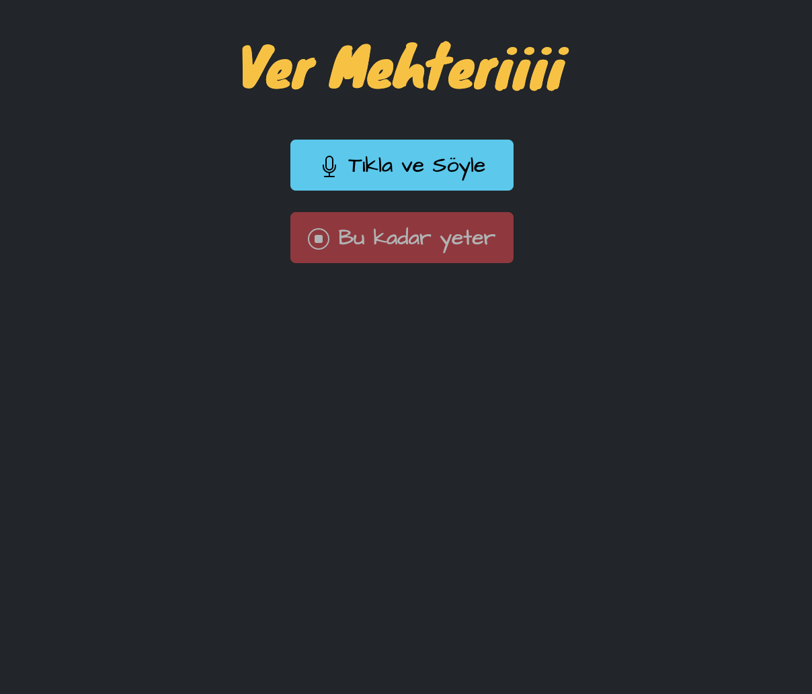

##  Ver Mehteri uygulaması

Uygulama tamamen **eğlence amaçlı** geliştirilmiştir. Web speech API kullanılarak sesli komutlar yardımıyla etkileşim sağlanıyor.

### Çalıştırma

```

$ git clone https://github.com/melihs/ver-mehteri.git

$ cd ver-mehteri

son olarak da index.html dosyasını açın. :)

```

### Ekran görüntüsü



### Yapılacaklar
* vue ile chatbot uygulaması (belki de jarvis :))
